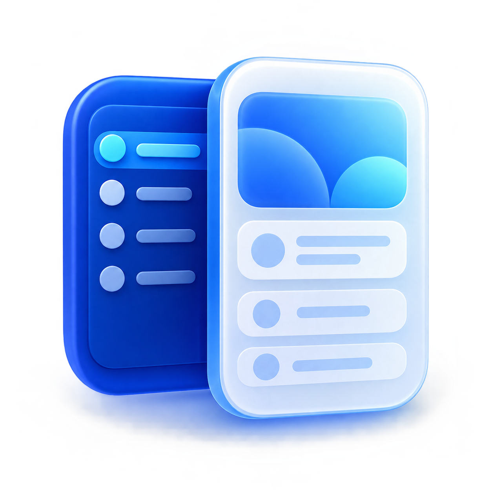
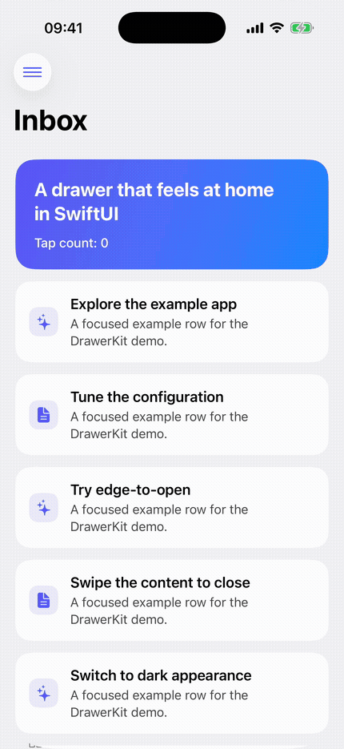
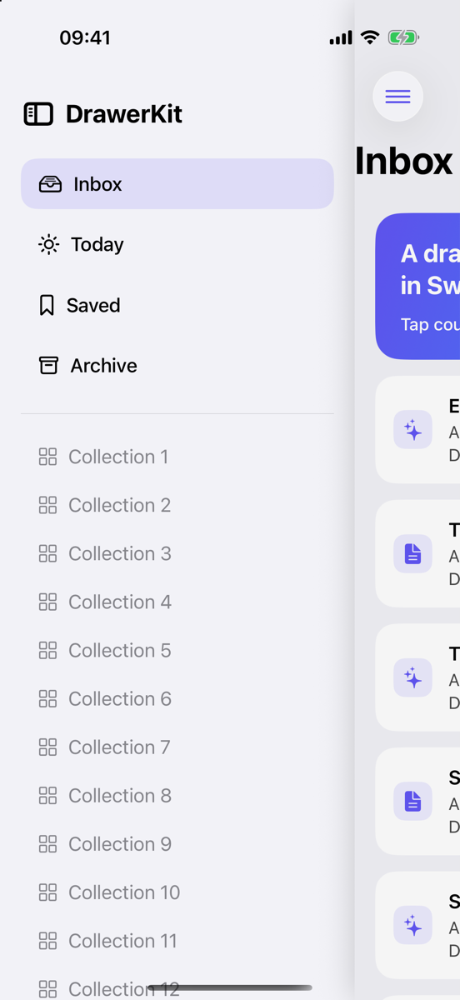
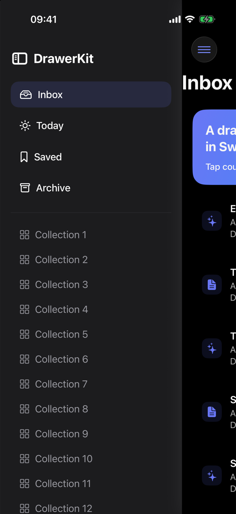

<p align="center">
  
</p>

<h1 align="center">DrawerKit</h1>

<p align="center">A focused, native-feeling drawer for SwiftUI.</p>

<p align="center">
  <a href="https://github.com/jakub-kalamarz/DrawerKit/actions/workflows/ci.yml"></a>
  <a href="https://swiftpackageindex.com/jakub-kalamarz/DrawerKit"></a>
  
  <a href="LICENSE"></a>
</p>

<p align="center">
  
</p>

DrawerKit reveals navigation by moving your app's content aside. It is a small SwiftUI package:
one view, one configuration value, zero runtime dependencies.

<p align="center">
  
  &nbsp;&nbsp;
  
</p>

## Features

- Interactive edge-to-open and swipe-to-close gestures
- A fully interactive drawer panel
- Main content that cannot tap or scroll while the drawer is open; one tap closes it
- Leading and trailing drawers with automatic right-to-left layout support
- Device-aware content corners, shadows, scrim and haptic feedback
- Reduce Motion and VoiceOver escape support
- Adaptive width that always preserves a dismiss target
- No UIKit view controllers and no third-party dependencies

## Installation

Add `https://github.com/jakub-kalamarz/DrawerKit` in Xcode's package dependency dialog and select
**Up to Next Major Version** from `1.0.0`, or add it to `Package.swift`:

```swift
dependencies: [
    .package(url: "https://github.com/jakub-kalamarz/DrawerKit", from: "1.0.0")
]
```

Then add `DrawerKit` to your target dependencies.

## Quick start

```swift
import DrawerKit
import SwiftUI

struct RootView: View {
    @State private var isDrawerOpen = false

    var body: some View {
        Drawer(isOpen: $isDrawerOpen) {
            SidebarView()
        } content: {
            NavigationStack {
                HomeView()
                    .toolbar {
                        Button("Open", systemImage: "line.3.horizontal") {
                            isDrawerOpen = true
                        }
                    }
            }
        }
    }
}
```

The `isOpen` binding is the source of truth. You can change it from a toolbar button, app state,
deep link, or any other SwiftUI action.

## Configuration

Create a value, change only what you need, and pass it to `Drawer`:

```swift
var drawerConfiguration: DrawerConfiguration {
    var configuration = DrawerConfiguration()
    configuration.width = 300
    configuration.edge = .trailing
    configuration.contentDimOpacity = 0.08
    return configuration
}
```

| Property | Default | Notes |
| --- | --- | --- |
| `width` | `320` | Clamped to fit while preserving a 44-point dismiss target |
| `contentCornerRadius` | `nil` | Matches system/device corners; explicit values are clamped to zero or higher |
| `animation` | `.easeInOut(duration: 0.25)` | Set to `nil` for no animation |
| `shadowRadius` | `14` | Clamped to zero or higher |
| `shadowColor` | `nil` | Automatically derived from the color scheme |
| `isRevealGestureEnabled` | `true` | Disable on horizontally scrolling content such as kanban boards |
| `isCloseGestureEnabled` | `true` | Controls interactive swipe-to-close |
| `edgeRevealWidth` | `24` | Width of the closed-state gesture strip |
| `minimumDragDistance` | `10` | Distance before a drag gesture begins |
| `openThreshold` | `0.5` | Clamped to `0...1` |
| `backgroundColor` | system background | Drawn behind the panel and moved content |
| `providesHapticFeedback` | `true` | Soft impact when state changes |
| `contentDimOpacity` | `0` | Clamped to `0...1` |
| `edge` | `.leading` | `.leading` or `.trailing`; both honor layout direction |
| `respectsReduceMotion` | `true` | Suppresses the configured animation when requested |
| `closeAccessibilityLabel` | `"Close navigation"` | Localize this in your app |

## Interaction and accessibility

When open, the panel stays interactive while the moved main content is hidden from accessibility
and has hit testing disabled. A transparent dismiss control above it consumes taps, so tapping the
main area closes the drawer without activating or scrolling anything underneath. A horizontal
drag still closes interactively.

DrawerKit mirrors leading/trailing geometry in right-to-left layouts, responds to the VoiceOver
escape action, and respects Reduce Motion by default. The host owns panel semantics and localized
labels.

## Example app

Open `Examples/DrawerKitDemo/DrawerKitDemo.xcworkspace`. The demo contains a real navigation panel
plus UI tests for dismissal, panel interaction, dragging, and accessibility. A Tuist manifest is
included for contributors who want to regenerate the project.

## Documentation

Build the DocC catalog in Xcode, or run:

```sh
xcodebuild docbuild \
  -scheme DrawerKit \
  -destination 'generic/platform=iOS Simulator'
```

## Requirements

- iOS 18+
- Swift 6.0+
- Xcode 26+

## Contributing

Issues and pull requests are welcome. Read [CONTRIBUTING.md](CONTRIBUTING.md) before starting a
larger change. DrawerKit follows the [Contributor Covenant](CODE_OF_CONDUCT.md).

## License

DrawerKit is available under the MIT License. See [LICENSE](LICENSE).
